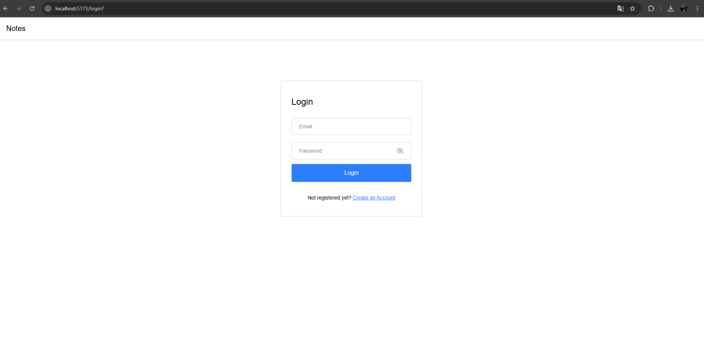

# Login Page

## Kullanılan Teknolojiler

**İstemci:** React, Vite, TailwindCSS

## Bilgisayarınızda Çalıştırın

Projeyi klonlayın

```bash
  git clone https://link-to-project
```

Proje dizinine gidin

```bash
  cd my-project
```

Gerekli paketleri yükleyin

```bash
  npm install
```

Sunucuyu çalıştırın

```bash
  npm run start
```

## Ekran Görüntüsü


